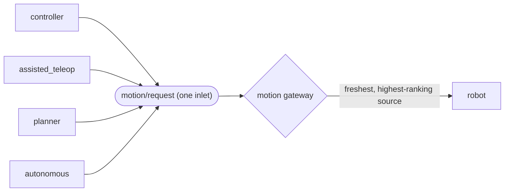

# Driving

## The two ways in

**The contract** is the supported interface: {mod}`robodog_sdk.topics` binds
every key to its payload type, and {mod}`robodog_sdk.msgs` holds the schemas.

```python
from zenode import publish
from robodog_sdk import MotionTopics, MovementCommand

cmd = publish(MotionTopics.request)
cmd.put(MovementCommand(x=0.3))
```

**{class}`~robodog_sdk.client.RobotClient`** is a facade over exactly that —
same keys, same priority, no privileged access. It exists so a first node is
short:

```python
async with robot.driving(x=0.3):
    await asyncio.sleep(2)  # stops on the way out, always
```

Use whichever reads better. Dropping to the contract is not leaving the
supported path.

## Commands expire

Movement keys carry `max_age = 0.3 s`
({data}`~robodog_sdk.topics.COMMAND_MAX_AGE`), which is the deadman: stop
publishing and the robot stops. One `robot.move(...)` drives for 300 ms, not
until you say otherwise. Use `robot.driving(...)`, or publish at 10 Hz
yourself.

Age is measured across hosts, so it requires synchronized clocks (NTP/chrony).

## Velocities are bounded

{class}`~robodog_sdk.msgs.motion.MovementCommand` enforces the robot's
capability envelope ({mod}`robodog_sdk.limits`), so an out-of-range value
raises `ValidationError` in *your* process rather than surprising anyone in
the lab. If a limit is wrong, fix it in `limits.py` — not by working around
the model.

## You are not the only driver, and you do not ask to be

Every source publishes to one inlet and the motion gateway forwards whichever
*fresh* command carries the highest-ranking
{class}`~robodog_sdk.msgs.motion.MovementSource` —
`controller` > `assisted_teleop` > `planner` > `autonomous`. There is no lock
to take and none to release: priority rides on every frame, so a human
touching the gamepad wins instantly, and you resume by yourself when they
stop. Read `robot.preempted_by` if you want to know; ignoring it is also
correct.



The corollary is that **`source` is not a label, it is the claim**. It
defaults to `autonomous`, the bottom rank. Setting it higher takes the robot
away from whoever that rank belongs to, so only set it if you are that thing.

## When commands go out and nothing moves

Read `robot.state.gateway`. The gateway says who won (`active_source`), what
it did to their command (`action`, `active_zones`), and whether the winner
went silent (`watchdog_tripped`). It is the difference between debugging for
an hour and reading one message. It is published on every change and
re-asserted about once a second, so a value going stale means the gateway
itself is gone.

`GatewayAction.stop` does not mean zero. A breached stop zone is
*directional*: only the velocity heading into the obstacle is stripped, so the
robot can still reverse or turn out of the zone. Only an obstacle that
surrounds it, a stale LiDAR scan or a tripped watchdog collapses the command
entirely.
